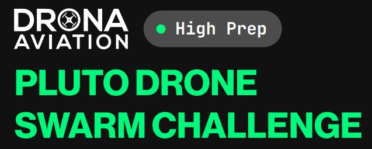
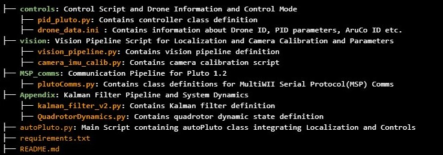
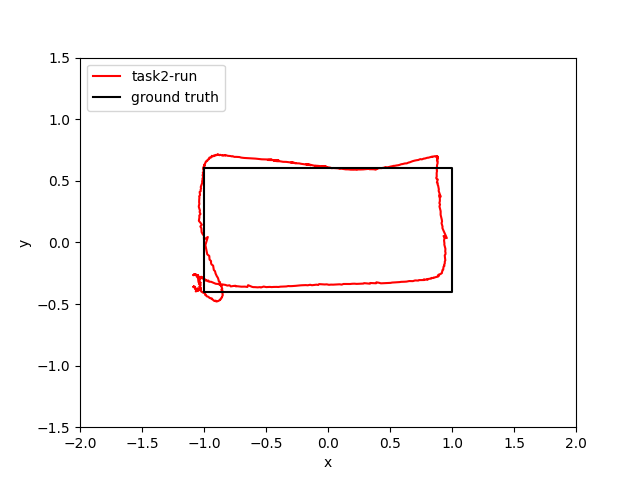
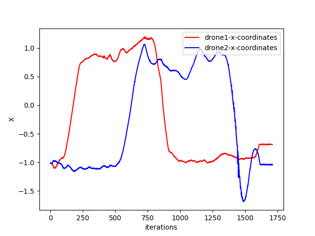
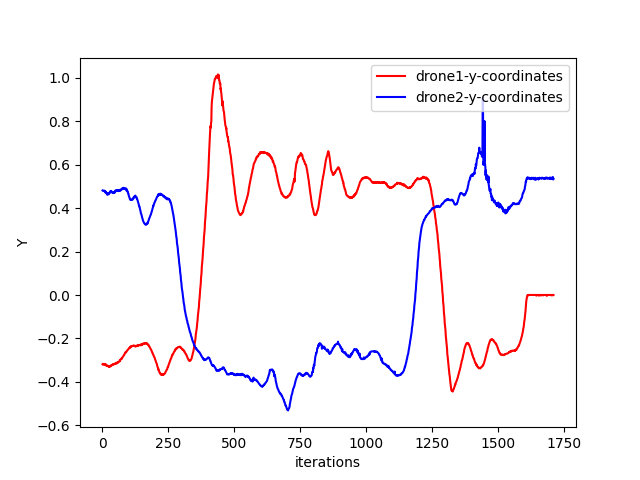

# DRONA AVIATION: PLUTO DRONE SWARM CHALLENGE 

<!--  -->


### Our report can be found on the following link : [ADD LINK HERE]().

### To learn more about our API, check out our documentation on the following link : [ADD LINK HERE]().

## Overview
The world is evolving rapidly, and in this stride forward, “the sky is the limit”. A part in this evolution is being played by the advent of drones in various applications ranging from commercial deliveries to recreation. India is anticipated to be the world’s 3rd-largest drone market [Drone Industry Insights Report 2020], with a projected worldwide industry of $42.8 billion by 2025. This new emerging sector would attract new talent and investments.

Early exposure is the need of the hour to help build the talent needed to support this vision. With many complicated algorithms, software, and much time to set up your drone, Python programming language would be the right step towards an easy and accelerated learning curve and help the new entrants develop their solutions to real-world problems.

Drona Aviation is building an ecosystem to support this skill development through Pluto - India’s only developer drone platform supporting the Indian Nano-Drone. Drona Aviation is primarily based on 4 fundamental principles complementing one another.

The organization has worked hard to provide an open-source implementation with learning content. This serves as the basis for building upon their work, which is precisely what the company intends - helping young talents explore and incorporate their ideas.

The report is based on the team's journey while attempting the “Pluto Drone Swarm Challenge”.


## Problem Statement
#### Task 1 :

Using Python, set up socket communication to connect to the Drone and send and receive Multi-Wii Serial Protocol packets. Multiple commands - Take-Off, Land, Pitch Forward, etc. are to be implemented as present in the ROS package and Magis Firmware.

#### Task 2 :

The second task utilizes this python wrapper to achieve two objectives -

(i) Hover the drone at a particular position, specified to be close to 4 feet with some variations
(ii) Move the drone in a rectangular motion, following a trajectory of predefined dimensions

The general framework to achieve these two objectives is provided. An ArUco Tag would be used to estimate the drone's position based on visual data from a USB web camera attached to the ceiling of the area where the drone is to be flown. Based on this feedback, a controller [Mentioned as a PID Controller] would be responsible for holding the drone on a trajectory.

#### Task 3 :

The idea is to get one drone to follow the other, given a specified set of endpoints as defined in the problem statement. The final demonstration would ideally require one drone to retrace the trajectory of the other one as closely as possible. This task would require all the solutions developed for the previous two tasks.

## Table of Contents

1. [Installation](#installation)
2. [How to Connect](#how-to-connect)
2. [How To Run](#how-to-run)
3. [Code Structure](#code-structure)
4. [Fail Safe](#fail-safe)
4. [Results](#results)

# Installation

This repository is built using Python 3.9.6 and tested on Ubuntu 22.04 LTS and Ubuntu 20.04 LTS environment. Follow these intructions

1. Clone the repository  

    ```bash
    git clone correct link
    ```

2. Run the following command to install the required dependencies

    ```bash
    python3 -m pip install -r requirements.txt
    ```
# How to Connect

The following procedure needs to be followed to connect the Pluto Drone / Drones in client mode [Note : This requires two systems with Wi-Fi] -
 
 1. Turn on Wireless Hotspot on the primary system which will run the scripts for the Pluto Swarm Challenge
 2. Connect to the Pluto Drone Wi-Fi by entering the provided password on the secondary system. This needs to be performed individually for each drone.
 3. Run the shell script on the secondary system 
    ```bash
    ./setup.sh
    ```
 4. Verify the connection and note the IP address of the connected Drone / Drones on the primary system using the following command
     ```bash
    arp -a
    ```
 5. Add the correct IP addresses to the `droneData.ini` file in the **********<ADD>
 
 
 
 
# How To Run

`autoPluto.py` is the main python script which defines the class and also calls it to run the drone accordingly in the hover or rectangle tracking mode.

1. Connect to the Pluto Drone Wifi by entering the provided password.
2. Navigate to the directory where repository is cloned

    ```bash
    cd add correct
    ```
    
    To set the mode make appropriate changes in the `mode` attribute of `droneData.ini` file present in the controls directory.
    
    
3. Run the script autoPluto.py to run the different parts of task 02. 

    ```bash
    python add correct
    ```


    
# Code Structure
### NEEDS TO BE UPDATED


# Fail Safe
When the drone moves out of the Field of View of the overhead camera for a pre-set time duration, the drone lands safely. 
<p align = "center">

</p>  

# Results

#### We show results in two cases -

1. Following a rectangle of dimensions [1m X 2m]
<p align = "center">

</p>

The following metrics were used to ensure that our path tracking was as close to ideal as possible -
<table align = "center">
  <tr>
    <td>     Cross Track Error   </td>
    <td>        Error in Z co-ordinate  </td>
  </tr>
  <tr>
    <td></td>
    <td></td>
  </tr>
 </table>

The first plot [Left] shows the x vs y coordinate of the drone, which clearly shows the drone following a tight rectangular trajectory. The second plot [Right] shows the variation in z coordinate with time. There is a maximum error of 10cm over the course of the trajectory. The average time of flight is 29 seconds.
 
 2. Swarm Flight  [1m X 2m]
<p align = "center">

</p>

The results were obtained when flying the two drones simultaneously -
<table align = "center">
  <tr>
    <td>     X Coordinates Vs Time   </td>
    <td>     Y Coordinates Vs Time   </td>
  </tr>
  <tr>
    <td></td>
    <td></td>
  </tr>
 </table>
 
The first plot [Left] shows the variation in x coordinate with time, which shows the phase difference between the two drones while ensuring they track the correct trajectory. The second plot [Right] shows the variation in y coordinate with time. The two results together show both the drones effectively tracking rectangular trajectories individually while also following each others trajectory. The average time of flight in this case is around 76 seconds.

### To view the entire video submission click on the following link : [Videos](Update Links in Final Repositories)

